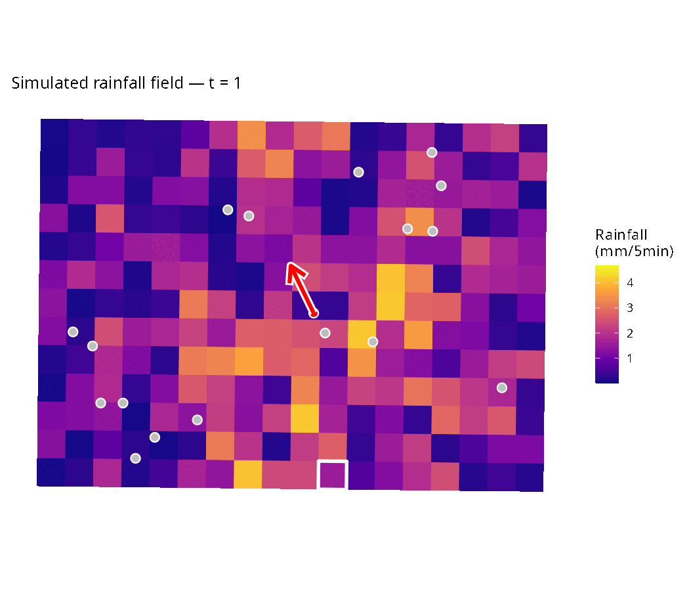

# Spatio-Temporal Modeling of Urban Extreme Rainfall Events

This repository contains the code associated with the paper:

> **Spatio-temporal modeling of urban extreme rainfall events at high resolution**  
> Serre-Combe, Meyer, Opitz, and Toulemonde

DOI: [10.48550/arXiv.2602.19774](10.48550/arXiv.2602.19774)

<p align="center">
  <br>
  <em>Simulated extreme rainfall episode using the proposed spatio-temporal model.</em>
</p>

## Overview

This repository implements a spatio-temporal stochastic model for urban rainfall extremes in Montpellier.  
The model used combines:

- **EGPD marginals** for modeling extreme rainfall intensities  
- A flexible extremal dependence structure based on **r-Pareto processes**
-  **Advection** incorporation to account for rain storm displacement

The model is calibrated on high spatio-temporal resolution data from the Montpellier **OMSEV** precipitation network and also the **COMEPHORE** reanalysis provided by Météo-France.

## Repository Structure

The code is organized as follows:

 ```
 script/
    ├── advection/
    │    └── Code to compute advection vectors
    ├── optim_data/
    │    └── Code for optimization on observed data (OMSEV or COMEPHORE)
    ├── rpareto/
    │    └── r-Pareto simulations and optimization validation
    ├── swg/
    │    └── Final stochastic rainfall generator
    └── wlse/
        └── Weighted Least Squares Estimation (OMSEV or COMEPHORE)
```

## Dependencies

This code uses the `generain` package, available at: [github/chloesrcb/generain](https://github.com/chloesrcb/generain)
